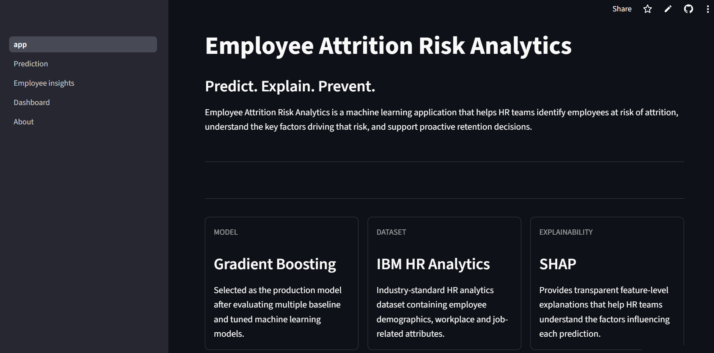
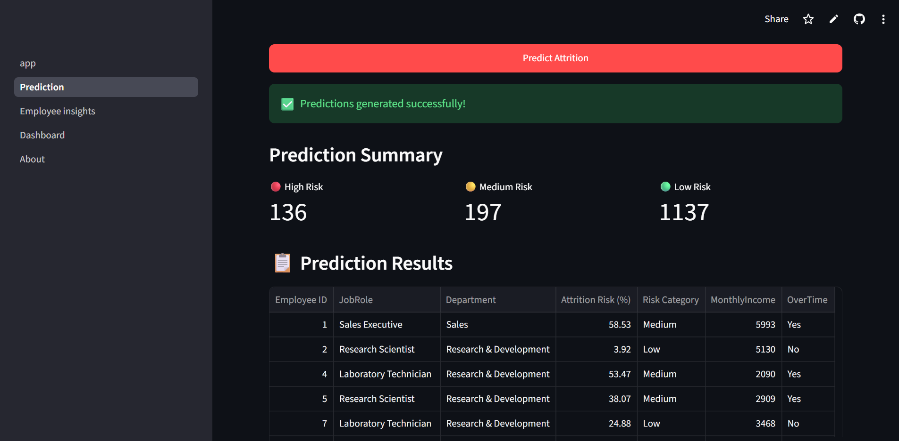
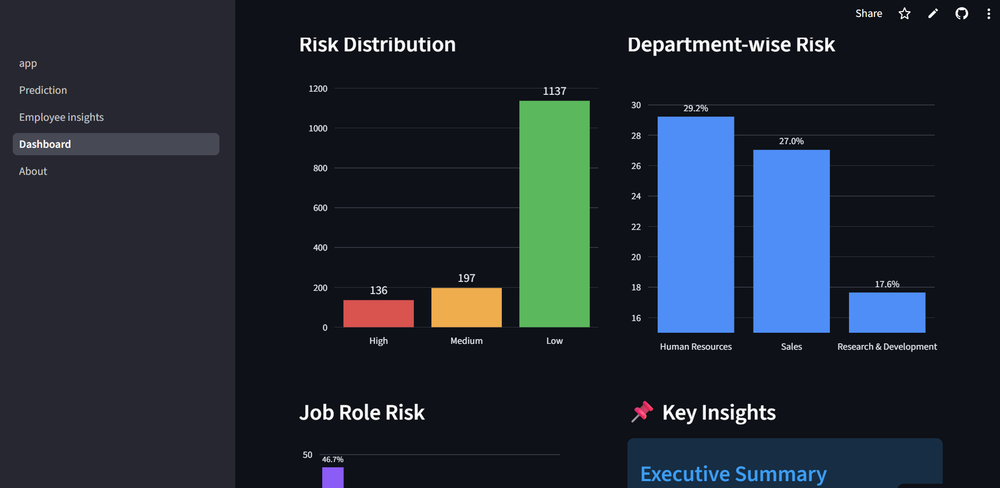
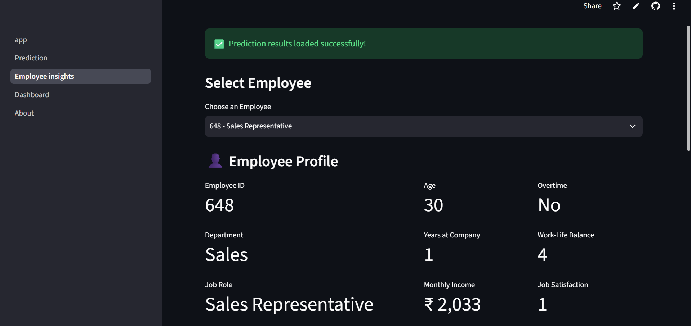
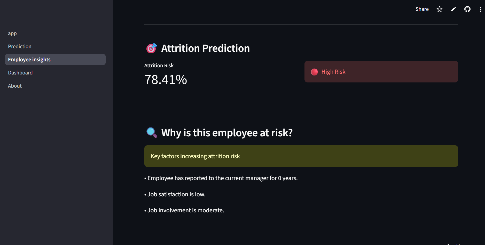
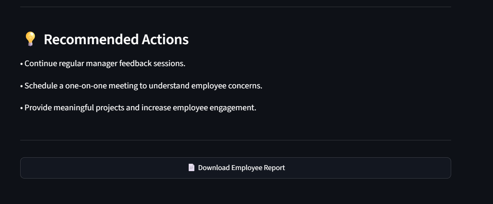
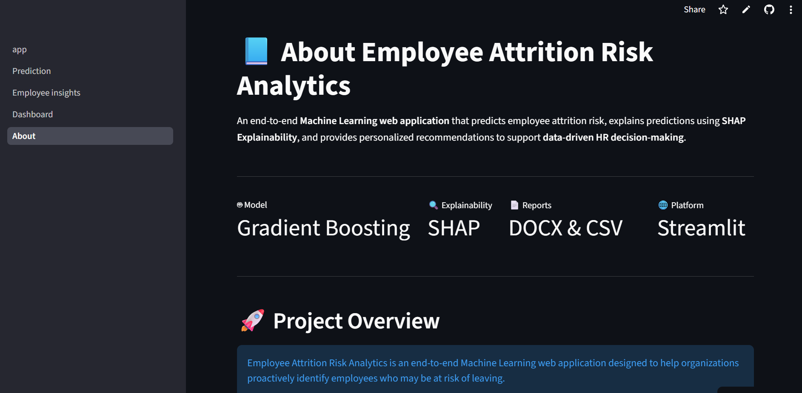

# 👨‍💼 Employee Attrition Risk Analytics

An end-to-end **Machine Learning web application** that predicts employee attrition risk, provides **SHAP-based explainability**, and generates personalized recommendations to support data-driven HR decision-making.

## 🌐 Live Demo

🚀 **Try the application here:** https://employee-attrition-risk-analytics.streamlit.app/


---

##  Project Overview

Employee attrition is a major challenge for organizations, leading to increased recruitment costs, productivity loss, and disruption to business operations.

This application helps HR professionals proactively identify employees at risk of leaving by leveraging a **Gradient Boosting Machine Learning model**. Beyond prediction, it provides **SHAP explanations**, personalized retention recommendations, interactive dashboards, and downloadable reports to enable informed HR decision-making.

---


## ✨ Features

- 📂 Upload employee datasets in CSV format
- 🤖 Predict employee attrition risk using a trained Gradient Boosting model
- 📊 Interactive dashboard with KPIs and visualizations
- 👤 Employee-level insights and risk analysis
- 🔍 SHAP-based explainability for every prediction
- 💡 Personalized retention recommendations
- 📄 Download employee reports (DOCX)
- 📥 Export high-risk employees as CSV
- 📘 Professional About page with project documentation

---

## 📂 Project Structure

```text
Employee-Attrition-Risk-Analytics/
│
├── app/
│   ├── app.py
│   ├── predictor.py
│   ├── utils.py
│   └── pages/
│       ├── 1_Prediction.py
│       ├── 2_Employee_Insights.py
│       ├── 3_Dashboard.py
│       └── 4_About.py
│
├── data/
│   └── raw/
│
├── images/
│
├── models/
│   ├── gradient_boosting_model.pkl
│   └── feature_columns.pkl
│
├── notebooks/
│   ├── 01_Data_Audit_and_EDA.ipynb
│   ├── 02_Preprocessing_and_Model_Development.ipynb
│   └── 03_Model_Optimization_and_Explainability.ipynb
│
├── README.md
├── requirements.txt
└── .gitignore
```

### 📁 Directory Overview

- **app/** – Streamlit application source code and application pages.
- **data/** – Raw dataset used for model development and testing.
- **images/** – Screenshots and visual assets used in the project documentation.
- **models/** – Trained Gradient Boosting model and supporting files used for prediction.
- **notebooks/** – Jupyter notebooks covering EDA, preprocessing, model development, and SHAP explainability.

---

## 🤖 Machine Learning Pipeline

The application follows a complete end-to-end machine learning workflow to transform employee data into actionable HR insights.

```text
Employee Dataset
        │
        ▼
Data Preprocessing
        │
        ▼
Gradient Boosting Model
        │
        ▼
Attrition Risk Prediction
        │
        ▼
Risk Categorization
        │
        ▼
SHAP Explainability
        │
        ▼
Personalized Recommendations
        │
        ▼
CSV & DOCX Report Generation
```

### Workflow Summary

- **Data Preprocessing** – Encodes and aligns employee data with the trained model for prediction.
- **Gradient Boosting** – Predicts the probability of employee attrition.
- **Risk Categorization** – Classifies employees into Low, Medium, or High Risk.
- **SHAP Explainability** – Explains the factors influencing each prediction.
- **Recommendations** – Generates personalized retention suggestions.
- **Report Generation** – Exports high-risk employee data and employee reports.
---

## 📊 Model Performance

The final application uses a **Gradient Boosting Classifier**, selected for its balanced predictive performance and ability to capture complex relationships within employee data.

| Metric | Score |
|--------|------:|
| Accuracy | **85.03%** |
| Precision | **54.29%** |
| Recall | **40.43%** |
| F1 Score | **46.34%** |
| ROC-AUC | **0.766** |

### Why Gradient Boosting?

The Gradient Boosting model was selected based on its ability to provide the best balance between predictive performance and generalization on the IBM HR Analytics dataset.

Its probability estimates also integrate effectively with **SHAP Explainability**, enabling transparent predictions and personalized employee-level insights.

---

## 📸 Application Screenshots

### 🏠 Home



---

### 📈 Prediction



---

### 📊 Dashboard



---

### 👤 Employee Insights

#### Employee Profile



#### Risk Explanation



#### Recommendations



---

### 📘 About



## 🛠️ Technology Stack

| Category | Technologies |
|----------|--------------|
| **Programming Language** | Python |
| **Machine Learning** | Scikit-learn (Gradient Boosting) |
| **Explainability** | SHAP |
| **Data Processing** | Pandas, NumPy |
| **Visualization** | Plotly, Matplotlib |
| **Web Framework** | Streamlit |
| **Report Generation** | python-docx |
| **Development Tools** | Git, GitHub & VS Code |

---

## 💻 Installation & Usage

### Clone the repository

```bash
git clone https://github.com/saraajaitly/employee-attrition-risk-analytics.git
```

### Navigate to the project directory

```bash
cd employee-attrition-risk-analytics
```

### Install the required dependencies

```bash
pip install -r requirements.txt
```

### Launch the application

```bash
streamlit run app/app.py
```

The application will open in your default web browser.
> **Note:** Ensure the trained model files are present in the `models/` directory before launching the application.

---

## 🚀 Future Enhancements

Potential improvements for future versions include:

- 🔐 Role-based authentication for HR users
- ☁️ Cloud database integration
- 📧 Automated email alerts for high-risk employees
- 📈 Advanced workforce analytics and trend analysis
- 🤖 Support for additional machine learning models
- 🌐 Public deployment for organization-wide access

---

## 👩‍💻 Author

**Saraa Jaitly**

B.Tech Artificial Intelligence & Data Science
🔗 **GitHub:** https://github.com/saraajaitly

This project was developed as an end-to-end Machine Learning portfolio project demonstrating predictive analytics, explainable AI, and interactive HR decision support using Streamlit.